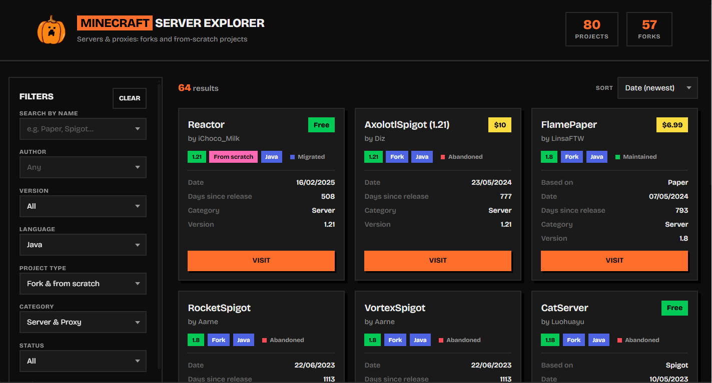
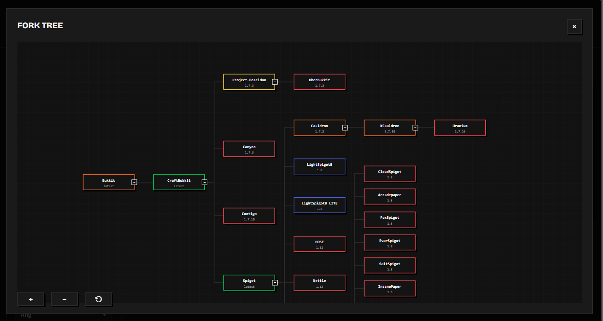

# [Minecraft Forks Explorer](https://dayssincelastjavamcserver.online/)

## Goals

An interactive web platform designed to search, filter, and analyze the ecosystem of Minecraft servers, proxies, and forks throughout its history. It allows users to compare details such as authors, game versions, language compatibility, and explore interactive visual family trees.

- **Historical Transparency**: Clear mapping of software lineages from their base projects (CraftBukkit, Spigot, Paper, etc.).
- **Health Monitoring**: Instant identification of project status (abandoned, active, migrated) via rigid color-coded indicators.
- **Advanced Filtering**: Fast searching by game version, creator, software type (server/proxy), and licensing.

> [!NOTE]
> The indexing and mapping of the Minecraft server family tree is constantly evolving.
> 
> If you notice a missing fork or want to update a project's status, please open an Issue in the repository.
> [You can add more servers here](js/data.js)

